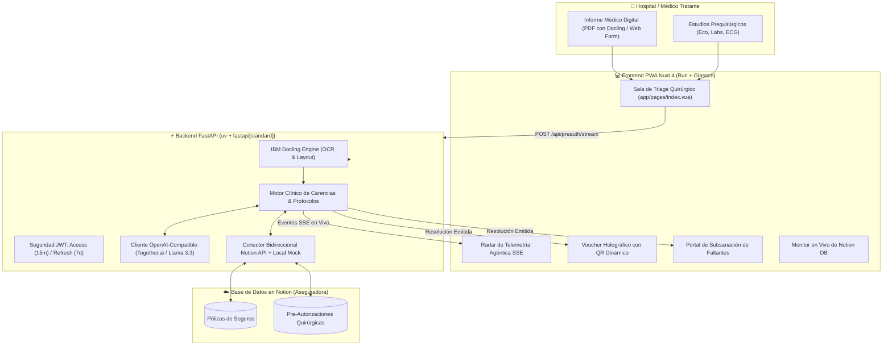

# 🩺 AuraQx — Agente de Pre-Autorización Quirúrgica en Tiempo Real

> **Solución para el Reto 1 del HackIAthon Viamatica & ADEN University**  
> *"De días de espera burocrática a segundos de certeza clínica y financiera."*

---

## 📌 Entregables Oficiales del HackIAthon (Reto Inicial)

* **Enlace Público de la Aplicación en Ejecución (PWA)**: [`https://auraqx.vertexdc.com`](https://auraqx.vertexdc.com)
* **API Pública del Backend (FastAPI Swagger Docs)**: [`https://api-auraqx.vertexdc.com/docs`](https://api-auraqx.vertexdc.com/docs)
* **Repositorio de Código Fuente**: [GitHub: AuraQx (o0Ghost0o/AuraQx)](https://github.com/o0Ghost0o/AuraQx)
* **PDF de Herramientas de IA Utilizadas**: [AuraQx_Herramientas_de_IA_Utilizadas.pdf](docs/entregables/AuraQx_Herramientas_de_IA_Utilizadas.pdf) | [Versión Markdown](docs/entregables/HERRAMIENTAS_DE_IA_UTILIZADAS.md)
* **Aviso de Privacidad y Cumplimiento LOPDP Viamatica S.A.**: [AVISO_PRIVACIDAD_VIAMATICA.md](docs/legal/AVISO_PRIVACIDAD_VIAMATICA.md)
* **Bases y Entregables Oficiales**: [hackIAthon-Panama-Bases-y-Entregables.pdf](docs/bases/hackIAthon-Panama-Bases-y-Entregables.pdf)
* **Correo de Envío**: `hackiathon@viamatica.com`

---

## 🚀 El Problema y la Solución

### El Problema
Actualmente, un paciente con indicación quirúrgica debe esperar entre **24 y 72 horas** para que su aseguradora apruebe el procedimiento. El hospital envía informes fragmentados por correo o papel; los auditores deben buscar manualmente la póliza, calcular meses de carencia y verificar requisitos médicos. Si falta una prueba, la solicitud se rechaza o posterga, poniendo en riesgo la salud del paciente y generando fricción entre el hospital y la aseguradora.

### La Solución: AuraQx
Un agente agéntico multimodal que opera en **menos de 3 segundos**:
1. **Ingestión Multimodal con IBM Docling**: Procesa informes médicos digitales o escaneados (PDFs/imágenes), reconociendo diagnósticos CIE-10, procedimientos CPT, urgencias y estudios adjuntos.
2. **Consulta en Base de Datos de Notion**: Localiza la póliza del asegurado en Notion en tiempo real, recuperando deducibles, porcentaje de cobertura y reglas contractuales.
3. **Auditoría Rigurosa de Carencias**: Calcula con precisión matemática los días y meses de vigencia activa frente a la carencia contractual requerida (ej. 10 meses para vesícula/hernias/maternidad, 0 días para emergencias vitales).
4. **Verificación de Protocolo Quirúrgico**: Audita el checklist de estudios indispensables (ej. ecografía reciente, laboratorio TP/TTP, riesgo cardiológico en mayores de 40 años).
5. **Emisión Instantánea y Sincronización con Notion**: Emite un voucher con código de pre-aprobación, desglose financiero 80/20 y código QR, o despliega un portal interactivo para **subsanar documentos faltantes con re-evaluación inmediata**, registrando todo en Notion.

---

## 🏗️ Arquitectura del Sistema



---

## 🛠️ Stack Tecnológico

| Capa | Tecnología | Características |
| :--- | :--- | :--- |
| **JS Runtime & Package Manager** | **Bun** | Utilizado **siempre** para dependencias, bundling y scripts de frontend. |
| **Frontend Framework** | **Nuxt 4** (`nuxt: "^4.0.0"`) | Estructura canónica `app/`, SSR: false (PWA SPA de alto rendimiento). |
| **PWA Engine** | **@vite-pwa/nuxt** | Service Worker con precaching inteligente, manifest y modo offline. |
| **Diseño & UI** | **shadcn-vue + Glasscn** | Glassmorphism oscuro (`backdrop-blur-xl`, obsidian slate-950, acentos cian/esmeralda). |
| **Backend API** | **FastAPI + uv + fastapi[standard]** | Ejecución nativa de comandos `fastapi dev` / `fastapi run`, alto throughput asíncrono. |
| **Extracción Multimodal** | **IBM Docling** (`docling`) | Análisis de layouts complejos, tablas clínicas y OCR en PDFs. |
| **Inferencia LLM** | **OpenAI-Compatible / Together.ai** | Llama 3.3 70B Instruct / DeepSeek V3 para enriquecimiento clínico. |
| **Seguridad** | **JWT (PyJWT + Bcrypt)** | Access Token (15 min) + Refresh Token (7 días) con auto-renovación en `401`. |
| **Base de Datos** | **Notion API + Reactive Store** | Cumple al 100% el reto con modo dual (API oficial + Store mock local garantizado). |

---

## 🧪 Casos de Demostración 1-Click (Evaluación Rápida)

En la barra superior de la aplicación, el jurado puede hacer clic en cualquiera de los 4 escenarios preconfigurados:

1. 🟢 **Caso Alfa — Pre-Aprobado Inmediato (Colecistectomía Laparoscópica)**:
   - Paciente de 45 años, 18 meses de vigencia en Plan Oro (carencia de 10 meses superada).
   - Todos los documentos presentes (Eco abdominal, Labs, Riesgo quirúrgico cardiológico, Presupuesto).
   - *Resultado*: **PRE-APROBADO** en 2.4s, cobertura al 80% ($2,120 USD asumidos por la aseguradora) y código `AUTH-2026-XXXX`.
2. 🟡 **Caso Beta — Documentos Faltantes (Hernioplastia Inguinal)**:
   - Paciente de 48 años con carencia cumplida, pero omitió la valoración cardiológica obligatoria por su edad y la ecografía de pared abdominal.
   - *Resultado*: **DOCUMENTOS FALTANTES**. Se abre el portal de subsanación interactivo que permite adjuntar los estudios pendientes con 1 clic y emitir la aprobación inmediata.
3. 🔴 **Caso Gamma — Carencia Insuficiente (Parto por Cesárea)**:
   - Paciente con solo 4 meses de vigencia en su póliza (la póliza estipula 10 meses de carencia para maternidad).
   - *Resultado*: **RECHAZADO FUNDAMENTADAMENTE** con desglose exacto: *"Faltan 6.0 meses para adquirir derecho de cobertura electiva"*.
4. ⚡ **Caso Delta — Emergencia Quirúrgica Vital (Apendicitis Aguda)**:
   - Paciente con apenas 15 días de vigencia en la póliza ingresado por peritonitis.
   - *Resultado*: **PRE-APROBADO INMEDIATO** mediante la aplicación automática de la cláusula de **Carencia 0 Días por Urgencia Vital**.

---

## 🔐 Capa de Seguridad (Tokens 15 min / 7 días)

- **Access Token**: JWT con vigencia de **15 minutos**.
- **Refresh Token**: JWT con vigencia de **7 días**.
- **Credenciales Demo**:
  - **Usuario**: `auditor_clinico`
  - **Contraseña**: `hackiathon2026`
  - *(Botón de 1-Click Demo Login disponible en la barra de navegación)*.
- **Auto-Refresh**: El composable `useAuth.ts` intercepta cualquier respuesta `401 Unauthorized`, renueva el token en segundo plano y reintenta la solicitud sin interrumpir la experiencia de usuario.

---

## 🚀 Guía de Inicio Rápido (Local)

### Requisitos Previos
- [uv](https://docs.astral.sh/uv/) (Python package manager)
- [bun](https://bun.sh/) (JS runtime & package manager)

### 1. Clonar el Repositorio
```bash
git clone https://github.com/o0Ghost0o/AuraQx.git
cd AuraQx
```

### 2. Iniciar con un Solo Comando
```bash
make dev
```
El comando levantará concurrentemente:
- **Backend FastAPI**: `http://127.0.0.1:8000` (Docs en `/docs`)
- **Frontend Nuxt 4 (PWA)**: `http://localhost:3000`

---

## 🌐 Generar Enlace Público para el Hackathon
Para generar un túnel HTTPS público para los evaluadores en 5 segundos:
```bash
make tunnel
```

---

## 🐳 Ejecución con Docker Compose
```bash
make docker-up
# O alternativamente: docker compose up --build
```

---

## 🧪 Pruebas Automatizadas

Para ejecutar la suite completa de pruebas unitarias y de integración del backend:
```bash
make test
# O alternativamente: cd backend && uv run pytest -v
```

Tests validados:
- Autenticación JWT y renovación de tokens (15m/7d).
- Bloqueo de accesos no autorizados a endpoints protegidos.
- Excepción de carencia 0 para cirugías de emergencia vital.
- Detección precisa de carencias no cumplidas.
- Detección de estudios obligatorios omitidos (riesgo quirúrgico según edad).
- Cálculo financiero de deducibles y copago 80/20.

---

## 📑 Configuración de Notion DB (Opcional)

AuraQx funciona de inmediato con su almacén reactivo integrado. Si deseas conectar tu propio espacio de Notion, crea un archivo `.env` en `backend/` con:

```env
NOTION_API_KEY=secret_tu_token_de_integracion
NOTION_POLICIES_DB_ID=tu_id_base_datos_polizas
NOTION_PREAUTHS_DB_ID=tu_id_base_datos_preautorizaciones
OPENAI_BASE_URL=https://api.together.xyz/v1
OPENAI_API_KEY=tu_api_key_de_together_ai
OPENAI_MODEL=meta-llama/Llama-3.3-70B-Instruct-Turbo
```

### Esquema de Propiedades de Notion
1. **Base de Datos de Pólizas**:
   - `Cédula` (Rich Text)
   - `Nombre` (Title)
   - `Número de Póliza` (Rich Text)
   - `Plan` (Select: Plan Oro, Plan Plata, Plan Esmeralda)
   - `Fecha Inicio` (Date)
   - `Estado` (Select: Activa, Suspendida)
2. **Base de Datos de Pre-Autorizaciones**:
   - `ID Solicitud` (Title)
   - `Paciente` (Rich Text)
   - `Póliza` (Rich Text)
   - `Procedimiento` (Rich Text)
   - `Hospital` (Rich Text)
   - `Estado` (Select: PRE_APROBADO, DOCUMENTOS_FALTANTES, RECHAZADO)
   - `Monto Cubierto` (Number)
   - `Copago Paciente` (Number)
   - `Carencia Cumplida` (Checkbox)
   - `Justificación` (Rich Text)

---

## 👥 Equipo y Autores
- **Equipo de Desarrollo**:
  - Pedro Carreras (`pcarreras@vertexdc.com`)
  - Alek Rutherford (`alekissac@gmail.com`)
- **HackIAthon**: Viamatica & ADEN University 2026
